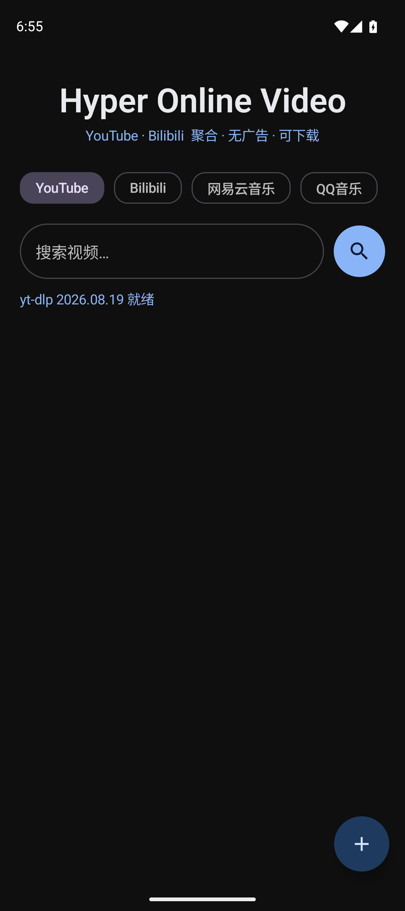
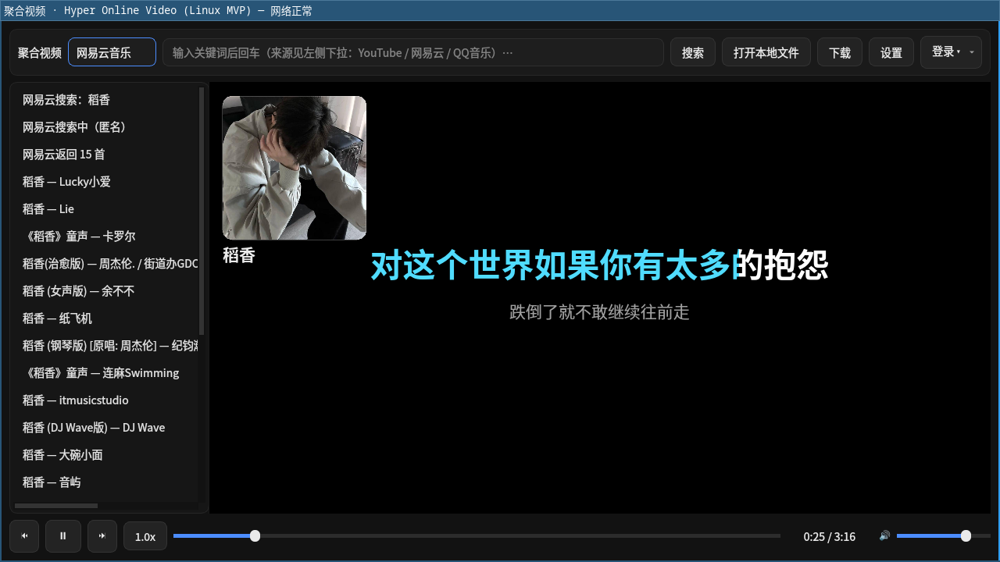
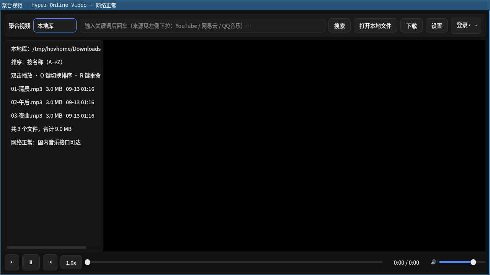
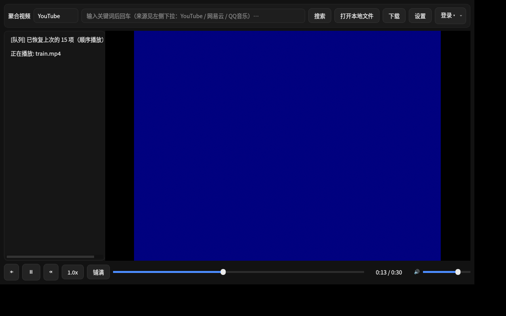
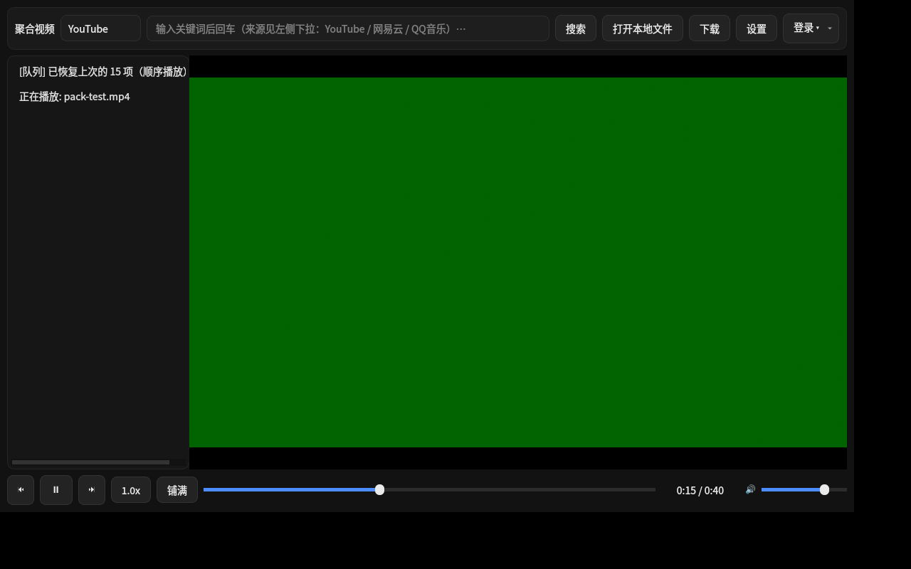
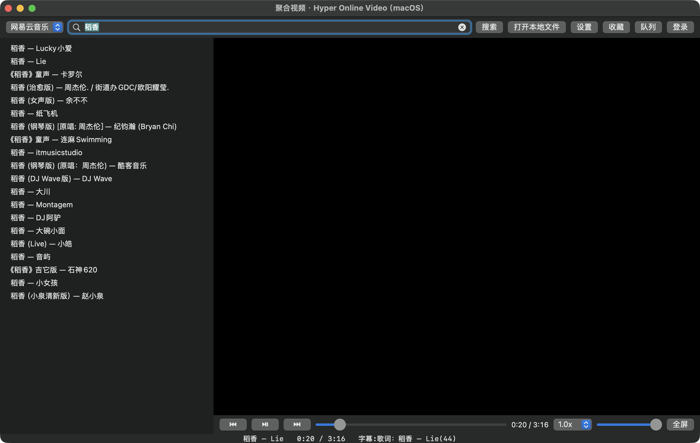
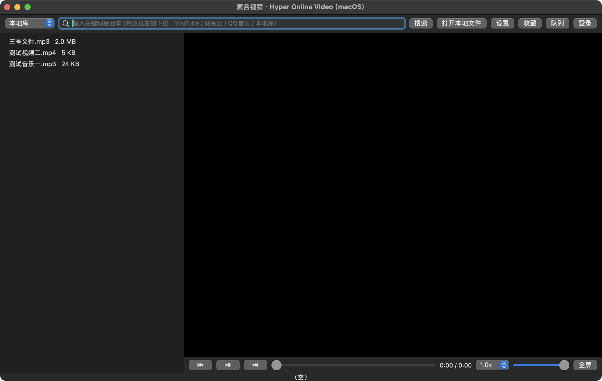
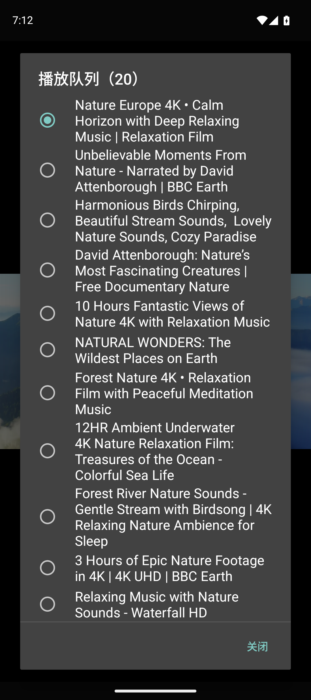
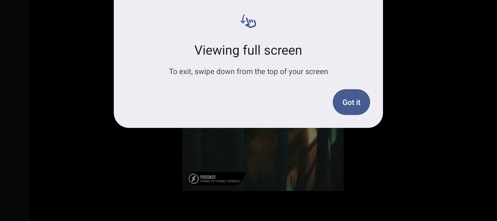

# 聚合视频 · Hyper Online Video

**YouTube · Bilibili · 网易云音乐 · QQ音乐 —— 一个 App，零广告，可下载。**

Android 原生播放器（Kotlin + Jetpack Compose + Material 3），基于 **libmpv** 播放、**yt-dlp** 下载，
支持在线看、离线存、后台听、队列连播、歌词、字幕、画中画。

---

### 📌 当前发布状态（v1.2.2 · 全平台正式发布）

| 平台 | 状态 | 获取方式（详细步骤见 [📦 安装指南](#-安装指南小白也能看懂)）|
|---|---|---|
| **Android** | ✅ v1.2.2 | [Releases](../../releases/latest) 下载 `app-release-1.2.2.apk` |
| **macOS**（Apple 芯片）| ✅ v1.2.2 | Releases 下载 `HyperOnlineVideo-1.2.2-arm64.dmg` |
| **Arch Linux / Manjaro** | ✅ v1.2.2 | AUR：`yay -S hov-qt` |
| **Fedora 44 / 45** | ✅ v1.2.2 | Copr：[`houge/hov-qt`](https://copr.fedorainfracloud.org/coprs/houge/hov-qt/) · `sudo dnf copr enable houge/hov-qt` |
| **openSUSE Tumbleweed** | ✅ v1.2.2 | OBS `home:houge`（x86_64 / aarch64 / riscv64）|
| **openSUSE Leap 16.0** | ✅ v1.2.2 | OBS `home:houge`（x86_64 / aarch64）|
| **NixOS** | ✅ v1.2.2 | flake：`github:HougeLangley/HyperOnlineVideo` |
| **Ubuntu / Debian / 其它** | ✅ 源码构建 | 3 条命令、约 5 分钟（见安装指南）|

> 💡 **Linux 全系都通过官方/第三方软件源安装** ✓ 用系统包管理器一键完成 ✓ 自动更新 ✓

<p align="center">
  
</p>

---

## 免责声明（请务必先读）

> **本项目仅供个人学习、研究与技术交流使用，请在使用前阅读并同意以下全部内容。**

1. **内容来源与版权**：本应用只是一个**播放与下载工具**，本身不存储、不上传、不分发任何音视频内容。
   所有内容均来自第三方平台（YouTube、Bilibili、网易云音乐、QQ音乐等）的公开接口，
   **版权归原作者与平台所有**。
2. **合法使用**：请仅将本应用用于**个人学习、备份自己有权访问的内容**等合法用途。
   **严禁**将其用于商业用途、二次分发、批量爬取、绕过平台付费/会员机制等任何侵权或违法场景。
3. **平台条款**：使用本应用下载或播放内容，可能违反相关平台的用户协议。
   **是否使用、如何使用，由你自行判断并承担全部后果**，与本项目作者无关。
4. **账号风险**：应用内登录使用官方网页完成，登录凭据（Cookie）**仅保存在你自己的设备本地**，
   不会上传到任何服务器。但因使用第三方客户端导致的账号异常、限流、封禁等风险，需你自行承担。
5. **无担保**：本软件按"现状"提供，不提供任何明示或暗示的担保。
   因使用本软件造成的任何直接或间接损失（包括但不限于数据丢失、设备损坏、法律纠纷），作者不承担责任。
6. **合规**：请遵守你所在国家/地区的法律法规。**若你不同意以上任何一条，请立即停止使用并卸载本应用。**

---

## 功能一览

### 视频（YouTube / Bilibili）
- 双平台聚合搜索，封面瀑布流、无限下滑加载
- 排序（相关度 / 最新 / 播放最多）与时长（短 / 中 / 长）过滤器
- **零广告播放**：只播 CDN 直链，不经过任何官方播放器页面
- 清晰度切换（YouTube HLS 变体直切 / B站 qn 重解析，切换后保持播放进度）
- 倍速播放、进度记忆（退出后自动续播）
- 后台播放（通知栏 / 锁屏 / 耳机媒体键）、画中画（小窗，按 Home 自动进入）
- 全屏沉浸（强制横屏 + 系统栏隐藏；全屏可"铺满屏幕"，消除左右黑边）
- 手势：左半屏上下滑调亮度、右半屏调音量、双击左右半屏快进/快退 5 秒

### 音乐（网易云音乐 / QQ音乐）
- 搜索、播放、下载（**MP3 / FLAC 保留专辑封面与标签**）
- **VIP 无损音质**（登录后按会员权益自动取流），播放器内可**实时切换音质**（无损 / 320k / 128k）
- 双语歌词（原文 + 译文），逐行高亮与自动滚动
- **流量强制直连**：音乐请求与流媒体始终走物理网络（不随系统 VPN 走代理），
  避免海外线路导致的版权区域拦截

### 通用
- **播放队列**：顺序 / 单曲循环 / 随机，音乐、视频、本地文件可混排；通知栏上/下一首
- **下载管理**：2 并发队列、排队状态、批量下载（长按多选）、失败重试、仅 WiFi 下载、2GB LRU 自动清理
- **本地库**：排序（最近/名称/大小/类型）、库内搜索、重命名（同名字幕联动）、音乐标签显示
- **字幕**：本地同名 `.srt` 自动加载；在线字幕（B站 CC / YouTube 人工与自动字幕）
- **收藏**：一键收藏，收藏列表整体入队播放
- 设置：进度记忆、自动连播、手势开关、音质上限、仅 WiFi 下载

---

## 三平台（Android / Linux / macOS）

本仓库是**单仓库三端**：Android 手机端 + Linux 桌面端（Qt6/Wayland）+ macOS 桌面端（SwiftUI/AppKit）。
三端**共用同一套配置文件**（`~/.config/hov/`：settings / queue / favorites / progress / cookies），
所以在任一端的设置、队列、收藏、播放进度、登录 cookie 都能被另两端直接复用。

| | Android | Linux（Qt6） | macOS（AppKit + SPM） |
|---|---|---|---|
| 源码 | `app/` + `core/`(KMP) | `desktop/src/`（C++，41 文件 / 8072 行） | `macos/Sources/`（Swift，26 文件 / 7597 行） |
| 播放引擎 | libmpv（`MpvWidget`） | libmpv render API（`MpvWidget`） | libmpv render API（`NSOpenGLView` + `MpvView`） |
| 构建 | `gradle :app:assembleDebug` | `cmake -B build -G Ninja -DCMAKE_BUILD_TYPE=Release && cmake --build build` | `cd macos && swift build -c release`（**无需 Xcode**） |
| 运行 | 安装 APK | `./build/hov-qt [--open <地址>]` | `./build/HyperOnlineVideo [--open <地址>]`；打包后双击 `.app` |
| 打包 | APK（R8 混淆 + 资源压缩） | **AUR / Fedora Copr / openSUSE OBS / Nix flake 四渠道**（见安装指南）；AppImage / Flatpak 脚本就绪 | `.app`（自包含动态库）+ DMG |
| 自动化自检 | 单元测试（PlayQueue 等） | `--queue-selftest` **105 项** | `--selftest-logic` **102 项** |
| 登录 | 内置 WebView | QtWebEngine；**无 WebEngine 的产物包走"系统浏览器登录 + cookie 导入"** | WKWebView（cookie 自动落盘）+ 同一套 cookie 导入 |
| 媒体控制 | MediaSession（通知栏/锁屏） | MPRIS（媒体键/playerctl） | `MPRemoteCommandCenter`（控制中心/键盘媒体键） |

### 三端能力差异（如实说明）

| 能力 | Android | Linux | macOS |
|---|---|---|---|
| 流量强制直连（无视 VPN 代理） | ✅ VpnService 内绕过 | ✅ 设置项（仅对环境变量代理生效） | ✅ 设置项 |
| 画中画 | ✅ 系统级 PiP | ✅ 置顶小窗（Wayland 下"置顶"由合成器决定） | ✅ 浮动小窗（`window.level = .floating`） |
| 全屏铺满（裁切黑边） | ✅ 全屏时 `panscan=1` | ✅ 同左（键 `Z` / 控制条「铺满」） | ✅ 同左（键 `Z` / 设置面板勾选） |
| 下载管理 | ✅（2 并发/仅 WiFi/2GB LRU） | ✅（2 并发/重试/LRU） | ✅（2 并发/重试/标签写入/LRU） |
| 播放中切清晰度/音质 | ✅ | ✅（`V`/`Q` 键） | ✅（`V`/`Q` 键） |
| 本地库 | ✅ | ✅ | ✅ |
| 在线字幕 | ✅ B站 CC / YouTube | ✅ B站 CC（官方 API）/ YouTube | ✅ 同左 |
| 逐字歌词 | ✅ | ✅ YRC/QRC | ✅ YRC/QRC |
| 歌曲标签/封面 | ✅ 下载时写入 | ✅ 下载时写入 | ✅ 下载时写入（B3） |
| **手机专属（桌面端不适用）** | | | |
| 手势（亮度/音量/双击快进退） | ✅ | 不适用（桌面用键鼠） | 不适用 |
| 仅 WiFi 下载 / 流量提醒 | ✅ | 不适用（桌面无蜂窝流量） | 不适用 |
| 系统级画中画（可脱离 App 窗口） | ✅ | 不适用（桌面为应用内小窗） | 不适用 |
| 竖屏手势锁 / 自动横屏 | ✅ | 不适用（桌面窗口自由缩放） | 不适用 |

> 说明：桌面端不是"未实现"，而是**移动端特有的交互在国内桌面环境没有对应物**，故标注"不适用"。
> 桌面端用等价能力覆盖：手势 → 快捷键（空格/←→/↑↓/`V`/`Q`/`Z`/`F`/`P`）、仅 WiFi → 无此需求、系统画中画 → 应用内置顶小窗。

### 配置文件（三端共用）

```
~/.config/hov/
├── settings.json     # 音质上限 / 字号 / 延迟 / 下载目录 / 下载上限 / 强制直连 / 进度记忆 …
├── queue.json        # 播放队列（顺序/单曲/随机 + 当前下标）
├── favorites.json    # 收藏
├── progress.json     # 播放进度（续播）
└── cookies/          # youtube.txt / bilibili.txt / netease.txt / qqmusic.txt（Netscape 格式，yt-dlp 可直接用）
```

## 📦 安装指南（小白也能看懂）

> 每种系统**只需复制粘贴几条命令** ✓ 不需要懂原理 ✓
> Linux 全系都**从软件源安装**（AUR / Copr / OBS / Nix flake）✓ —— 用系统包管理器一键完成 ✓ 随系统一起自动更新 ✓

### 📱 Android（手机 / 平板）

1. 打开本仓库的 **[Releases 页面](../../releases/latest)**
2. 在 "Assets" 区域点击 **`app-release-1.2.2.apk`** 下载
3. 在手机上打开这个文件；若提示「禁止安装未知应用」，按提示允许（安卓装非商店应用的标准流程 ✓）
4. 安装完成后，桌面会出现「**聚合视频**」图标 ✓

> 要求 **Android 15（API 35）及以上**（minSdk 35 · targetSdk 36）。

### 🍎 macOS（Apple 芯片 M 系列）

1. Releases 页面下载 **`HyperOnlineVideo-1.2.2-arm64.dmg`**
2. 双击打开，把「**聚合视频**」拖进 **应用程序** 文件夹
3. **第一次打开**会被 macOS 拦下（未做付费公证的应用都会这样 ✓ 正常现象）：
   - **方法 A**：在「应用程序」里 **右键点图标 → 选"打开" → 再点一次"打开"**
   - **方法 B（推荐，一劳永逸）**：打开「终端」粘贴下面这行，然后就能正常双击打开了：
     ```bash
     sudo xattr -dr com.apple.quarantine /Applications/HyperOnlineVideo.app
     ```

### 🐧 Linux —— 按你的发行版选一条照着复制

#### Arch Linux / Manjaro / EndeavourOS（AUR）

```bash
# ① 如果你还没有 AUR 助手（已有 yay 或 paru 则跳过这步）
sudo pacman -S --needed base-devel git
git clone https://aur.archlinux.org/yay.git /tmp/yay && cd /tmp/yay && makepkg -si

# ② 安装「聚合视频」（首次会自动编译，约 2-3 分钟）
yay -S hov-qt
```

> 以后 `yay -Syu` 更新系统时会自动带上它 ✓
> 支持 **x86_64 / aarch64 / riscv64** 三种架构 ✓

#### Fedora 44 / 45

```bash
# ① 加入软件源（只需执行一次）
sudo dnf copr enable houge/hov-qt

# ② 安装
sudo dnf install hov-qt
```

> 支持 **x86_64 / aarch64 / riscv64** ✓

#### openSUSE Tumbleweed

```bash
# ① 加入软件源（只需执行一次）
sudo zypper addrepo https://download.opensuse.org/repositories/home:/houge/openSUSE_Tumbleweed/ obs-houge

# ② 安装
sudo zypper install hov-qt
```

> 支持 **x86_64 / aarch64 / riscv64** ✓

#### openSUSE Leap 16.0

```bash
# ① 加入软件源（只需执行一次）
sudo zypper addrepo https://download.opensuse.org/repositories/home:/houge/openSUSE_Leap_16.0/ obs-houge-leap

# ② 安装
sudo zypper install hov-qt
```

#### NixOS（声明式 · flake）

**第一步**：编辑 `/etc/nixos/flake.nix`，在 `inputs` 里加一段、在 `outputs` 参数里带上 `hov-qt`：

```nix
{
  inputs = {
    # …… 你现有的 nixpkgs / home-manager 等保持不动 ……

    hov-qt = {                                    # ← 新增这段
      url = "github:HougeLangley/HyperOnlineVideo";
      inputs.nixpkgs.follows = "nixpkgs";         # 复用你现有的 nixpkgs（省下载 ✓）
    };
  };

  outputs = { self, nixpkgs, hov-qt, ... }: {     # ← 把 hov-qt 加进参数列表
    nixosConfigurations.<你的主机名> = nixpkgs.lib.nixosSystem {
      # …… 你现有的配置保持不动 ……
    };
  };
}
```

**第二步**：编辑 `configuration.nix`（用 home-manager 的话就是 `home.nix`，写法为 `home.packages = [ … ];`）：

```nix
environment.systemPackages = [
  inputs.hov-qt.packages.x86_64-linux.default
];
```

**第三步**：重建系统：

```bash
sudo nixos-rebuild switch
```

> 不想改配置、只想先试试？
> `nix run github:HougeLangley/HyperOnlineVideo`
> （直接从 GitHub 构建并运行 ✓ 不写入系统 ✓ 用完即走 ✓）

#### Ubuntu / Debian / 其它发行版（源码构建 · 约 5 分钟）

目前没有现成软件源，但构建只有三步（Ubuntu 26.04 / Debian 13 实测通过）：

```bash
# ① 安装构建依赖
sudo apt update
sudo apt install -y git cmake ninja-build pkgconf \
  qt6-base-dev qt6-declarative-dev qt6-webengine-dev \
  libmpv-dev mpv ffmpeg yt-dlp

# ② 下载源码并编译
git clone https://github.com/HougeLangley/HyperOnlineVideo.git
cd HyperOnlineVideo/desktop
cmake -B build -G Ninja -DCMAKE_BUILD_TYPE=Release -DHOV_WEBENGINE=ON
cmake --build build

# ③ 运行
./build/hov-qt
```

> **想安装到系统（带桌面图标、终端直接敲 `hov-qt`）**：
> ```bash
> sudo cmake --install build --prefix /usr/local
> sudo update-desktop-database 2>/dev/null || true
> ```
> 完成后从应用菜单或终端启动 ✓

---

## 截图

### Linux（Qt6 / Wayland）

| 网易云：封面 + 逐字歌词 | 本地库 |
|---|---|
|  |  |

### Linux（历史截图 · clang + full-LTO + PGO 优化构建）

| 本地视频播放（进度由属性快照驱动） | 打包产物实际运行（历史归档） |
|---|---|
|  |  |

### macOS（AppKit + SPM）

| 搜索 + 歌词面板 | 本地库 | 字幕渲染 |
|---|---|---|
|  |  |  |


> 全部截图取自 Android 模拟器（Pixel 9 / Android 15 / 1080×2424）。

### 搜索与播放（YouTube / Bilibili）

| 主界面 | 搜索结果 | 播放中 |
|---|---|---|
|  |  |  |

| 全屏铺满（消除左右黑边） | 播放队列 | |
|---|---|---|
|  |  | |

### 本地库 · 设置 · 存储

| 本地库（排序 / 搜索 / 重命名） | 设置（播放偏好 / 音质上限 / 铺满屏幕） | 存储管理（2GB LRU） |
|---|---|---|
|  |  |  |

## 从零构建 · Android

### 1. 环境要求

| 组件 | 版本要求 | 说明 |
|---|---|---|
| JDK | **17 或更高**（开发时使用 26） | Gradle 需要；项目在 `gradle.properties` 中可钉 `org.gradle.java.home` |
| Android SDK | compileSdk **37** / build-tools 35+ | 需接受 SDK 许可 |
| Gradle | 9.x（用项目自带 wrapper 亦可） | 依赖 AGP 9.4 |
| 系统 | macOS / Linux（Windows 未验证） | 构建机需能访问 Maven Central |

> `minSdk 35`、`targetSdk 34`（**刻意低于 35**：35 的强制 edge-to-edge 会与输入法、
> 状态栏 inset 冲突，详见项目文档的"踩坑"记录）。

### 2. 配置 SDK 路径

在项目根目录创建 `local.properties`（**已在 .gitignore 中，不会入库**）：

```properties
sdk.dir=/Users/你的用户名/Library/Android/sdk     # Linux: /home/你/Android/Sdk
```

或者设置环境变量：

```bash
export ANDROID_HOME=$HOME/Library/Android/sdk
export JAVA_HOME=$(/usr/libexec/java_home -v 17)   # 或你的 JDK 路径
```

### 3. 编译调试版并安装

```bash
git clone https://github.com/HougeLangley/HyperOnlineVideo.git
cd HyperOnlineVideo

# 编译 Debug APK
./gradlew :app:assembleDebug
# 产物：app/build/outputs/apk/debug/app-debug.apk

# 有线安装（设备需开启 USB 调试）
adb install -r app/build/outputs/apk/debug/app-debug.apk

# 或无线安装（Android 11+：先在开发者选项开启「无线调试」）
adb connect <手机IP>:5555
adb install -r app/build/outputs/apk/debug/app-debug.apk
```

### 4. 运行单元测试

```bash
./gradlew :app:testDebugUnitTest
# 报告：app/build/reports/tests/testDebugUnitTest/index.html
```

### 5. 编译发布版（Release，需自签名）

项目**不包含**任何签名密钥。请自行生成 keystore：

```bash
mkdir -p ~/keystores
keytool -genkeypair -v \
  -keystore ~/keystores/hov-release.jks \
  -alias hov -keyalg RSA -keysize 4096 -validity 10950
```

然后创建 `~/keystores/keystore.properties`：

```properties
storeFile=/Users/你的用户名/keystores/hov-release.jks
storePassword=你的密码
keyAlias=hov
keyPassword=你的密码
```

```bash
./gradlew :app:assembleRelease
# 产物：app/build/outputs/apk/release/app-release.apk（含 R8 混淆与资源压缩）
```

> **没有 keystore 也能构建**：脚本检测不到 `keystore.properties` 时会跳过签名，
> 生成的是未签名包（无法安装，仅用于验证编译链路是否通畅）。

### 6. 版本号规范

- `versionCode`：每次对外发版 **+1**（Android 只比较大小，不要求连续）
- `versionName`：语义化版本 `主.次.修`，例如 `1.0.0`

### 常见构建问题

| 现象 | 原因与解决 |
|---|---|
| `Could not determine java version` | JDK 版本过低 → 升级到 17+，或修改 `gradle.properties` 里的 `org.gradle.java.home` |
| `SDK location not found` | 未配置 `local.properties` 或 `ANDROID_HOME` |
| `Failed to install ... INSTALL_FAILED_UPDATE_INCOMPATIBLE` | 设备上已有**不同签名**的同包名应用 → 先 `adb uninstall com.hougelangley.hov`（会清空应用数据） |
| Release 包启动闪退 | 若自行修改了依赖，注意为新引入的"静态初始化里反射扫类"的库补 R8 keep 规则 |

---

## 从零构建 · macOS（AppKit + Swift Package Manager，**不需要 Xcode**）

### 1. 环境要求

| 组件 | 要求 | 说明 |
|---|---|---|
| macOS | **13 Ventura 或更高** | 代码中 `platforms: [.macOS(.v13)]` |
| Swift 工具链 | **只需 Command Line Tools**，**无需完整 Xcode** ✓ | `xcode-select --install`（自带 `swiftc`；本项目实测 Swift 6.4，路径 `/Library/Developer/CommandLineTools`） |
| libmpv | `brew install mpv`（实测 0.41.0） | 通过 `pkgConfig: "mpv"` 接入（`Cmpv` 系统库目标） |
| 出 DMG（可选） | `brew install create-dmg` | 只有打包 DMG 时才需要 |

### 2. 构建与打包

```bash
brew install mpv create-dmg
cd macos
swift build -c release                    # 编译（纯 SPM）
bash packaging/build-app.sh               # 组装 .app + 收集依赖 + ad-hoc 签名 + 出 DMG
# 产物：macos/build/HyperOnlineVideo.app
#       macos/build/HyperOnlineVideo-<版本>-arm64.dmg
bash packaging/build-app.sh --no-dmg      # 只要 .app、跳过 DMG
```

`build-app.sh` 的 6 个步骤（**多数坑都在这里**）：

1. `swift build -c release`；
2. 组装 `.app` 骨架（`Info.plist` / 图标 / 可执行文件）；
3. **递归收集 libmpv 的全部非系统依赖**到 `Contents/Frameworks` 并**重写 `install_name`** ——
   不做这一步，DMG 换一台机器就打不开（依赖 Homebrew 路径）；
4. **ad-hoc 签名** —— Apple Silicon 上被改动过的二进制不签名无法运行；
5. `create-dmg` 出包（附「去隔离」使用说明）。

### 3. 首次运行被系统拦下

「系统设置 → 隐私与安全性 → **仍要打开**」。应用未做公证（notarization），这是如实说明的现状。

---

## 从零构建 · Linux（Qt6 桌面端）

Linux 端源码在 `desktop/`；**一套源码、多发行版打包**。

### 1. 依赖一览

| 用途 | Arch | Debian / Ubuntu | Fedora |
|---|---|---|---|
| Qt 6（Widgets / Network / DBus / OpenGLWidgets） | `qt6-base` | `qt6-base-dev` | `qt6-qtbase-devel` |
| Qt QML/Quick | `qt6-declarative` | `qt6-declarative-dev` | `qt6-qtdeclarative-devel` |
| 内嵌登录窗口（QtWebEngine，**可选**） | `qt6-webengine` | `qt6-webengine-dev` | `qt6-qtwebengine-devel` |
| 播放内核 | `mpv`（含 libmpv） | `libmpv-dev` | **`mpv-devel`** |
| 下载 / 混流 | `yt-dlp` `ffmpeg` | 同左 | `yt-dlp` + `ffmpeg-free`（自带，**无需第三方源**） |
| 构建 | `cmake ninja clang lld` | `cmake ninja-build pkgconf` | `cmake ninja-build pkgconf-pkg-config gcc-c++` |

> ⚠️ Fedora 上 libmpv 头文件在 **`mpv-devel`**（不存在 `mpv-libs-devel`）；
> 可用 `dnf provides '*/mpv/client.h'` 自行查证。

### 2. 直接编译（不打发行包）

```bash
cd desktop
cmake -B build -G Ninja -DCMAKE_BUILD_TYPE=Release
cmake --build build -j
# 产物：desktop/build/hov-qt
```

> **必须经由启动器运行**：`packaging/hov-qt-launcher.sh.in` 会在 exec 前设置 `LC_NUMERIC=C`
> 并调整 fd 上限 —— libmpv（ffmpeg 系代码）在非 C 数值 locale 下**会在动态库加载阶段直接终止**，
> 进程内 `setlocale` 来不及修。安装后的布局是 `/usr/bin/hov-qt`（脚本）+ `/usr/bin/hov-qt-bin`（真实二进制）。

可选构建开关：`-DHOV_LTO=ON`（clang + lld，full-LTO）、`-DHOV_PGO=use`、`-DHOV_WEBENGINE=OFF`（无 WebEngine 环境）。

### 3. 发行版打包（三条链路均已实测跑通）

**Arch Linux** —— `desktop/packaging/PKGBUILD`（**打包脚本的单一真相**）

```bash
cd desktop && makepkg -f
# → hov-qt-<版本>-<pkgrel>-<架构>.pkg.tar.zst
```

**Debian / Ubuntu** —— 标准 `debian/` 目录 + `dpkg-buildpackage`，**建议在容器内隔离构建**
（这样能真正校验 `Build-Depends` 是否完整）：

```bash
sudo apt-get install -y debootstrap systemd-container
sudo debootstrap --arch=amd64 --variant=buildd resolute /var/lib/machines/hov https://<镜像>/ubuntu/
sudo systemd-nspawn -D /var/lib/machines/hov --resolv-conf=copy-host \
     --bind="$PWD:/build" -M hov-build
# ── 容器内 ──
apt-get install -y build-essential debhelper cmake ninja-build pkgconf \
    qt6-base-dev qt6-declarative-dev qt6-webengine-dev libmpv-dev lintian
cd /build/<源码目录> && dpkg-checkbuilddeps && dpkg-buildpackage -us -uc
# 产物：.deb / .dsc / .debian.tar.xz / .buildinfo / -dbgsym.ddeb
```

**Fedora** —— `desktop/packaging/rpm/hov-qt.spec` + `mock` 隔离 buildroot：

```bash
# 1) 出 SRPM
rpmbuild --define "_topdir $HOME/hov-rpm" -bs SPECS/hov-qt.spec
# 2) mock 隔离构建（用后即销毁）
mock -r fedora-44-x86_64 --rebuild <SRPM> && mock -r fedora-44-x86_64 --scrub=all
# 项目脚本（自动串起上面两步）：desktop/packaging/rpm/build-rpm.sh <含 tarball 与 spec 的目录>
```

> ⚠️ **spec 的注释里绝不能出现宏名**（如 `%cmake`）—— RPM 会展开注释中的宏，
> 会产生 `Unknown tag` 之类难以理解的报错。写完先 `rpmspec -q <spec>` 预检。

### 4. Fedora Copr 第三方源（✅ **v1.2.2 正式渠道**）

```bash
sudo dnf copr enable houge/hov-qt
sudo dnf install hov-qt
```

> - 支持 **Fedora 44 / 45 × x86_64 / aarch64 / riscv64**（六个构建目标全部通过 ✓）；
> - 与 **AUR / openSUSE OBS / Nix flake** 并列为 Linux 正式发布渠道（完整清单见上方 [📦 安装指南](#-安装指南小白也能看懂)）；
> - 遇到问题欢迎到 **GitHub Issues** 反馈；
> - 仓库地址：<https://copr.fedorainfracloud.org/coprs/houge/hov-qt/>

### 5. 运行与配置文件

- 安装后从应用菜单启动「聚合视频」，或命令行 `hov-qt`；
- **三端共用配置**：`~/.config/hov/settings.json`、`queue.json`（覆盖升级不丢设置/数据）；
- 无显示环境（容器 / CI）跑自检：`QT_QPA_PLATFORM=offscreen hov-qt --queue-selftest`。

## 技术栈

| 层 | 选型 |
|---|---|
| 语言 / UI | Kotlin + Jetpack Compose + Material 3（深色主题） |
| 播放内核 | **libmpv**（mpv-android-lib）—— 硬解、多格式、精确 seek |
| 下载 | **yt-dlp**（内嵌 Python，随包分发 + 启动时自动检查更新） |
| 视频解析 | YouTube：播放器响应选流（HLS 视频 + DASH 音轨）；Bilibili：原生 API（buvid3 + SESSDATA） |
| 音乐解析 | 网易云（weapi 加密 + URL 签名）、QQ音乐（musicu.fcg + vkey） |
| 网络 | 音乐请求强制走物理直连网络；本地回环代理把 native 层流量也拉回直连 |
| 构建 | AGP 9.4 / Kotlin 2.2 / Compose BOM / Gradle 9 |

---

## 第三方组件与许可

本项目以 **GNU GPL-3.0-only** 发布。所有依赖均与 GPL-3.0 **兼容**：

| 组件 | 许可 | 与 GPL-3.0 兼容 |
|---|---|---|
| yt-dlp | The Unlicense（公共领域） | ✅ |
| Python | PSF License | ✅ |
| FFmpeg | LGPL-2.1+ / GPL（取决于构建选项） | ✅ |
| mpv / libmpv | LGPL-2.1+（GPL 部分按需启用） | ✅ |
| youtubedl-android | GPL-3.0 | ✅（同协议） |
| AndroidX / Jetpack Compose / Material 3 | Apache-2.0 | ✅ |
| Coil（图片加载） | Apache-2.0 | ✅ |
| Kotlin / kotlinx.coroutines | Apache-2.0 | ✅ |
| JUnit / org.json（仅测试） | EPL-1.0 / Public Domain | ✅ |

> 说明：GPL-3.0 要求**衍生作品同样以 GPL-3.0 开源**。
> 若你二次分发本项目的修改版，请一并提供完整源码。

---

## 隐私说明

- **登录**：使用各平台官方网页在应用内完成，登录凭据（Cookie）**仅保存在设备本地**
  （应用私有目录），不会上传到任何第三方服务器。
- **下载内容**：保存在设备本地（应用外部存储目录），应用不收集、不上传。
- **无统计、无追踪**：本应用不包含任何分析 SDK、广告 SDK 或遥测代码。
- **网络请求**：仅用于访问各平台官方接口与内容 CDN；音乐相关请求强制走物理直连网络。

---

## 喝杯咖啡 ☕

如果这个项目帮到了你，可以请我喝一杯咖啡 —— 完全自愿，不影响任何功能。

<p align="center">
  
</p>

---

## 致谢

- [yt-dlp](https://github.com/yt-dlp/yt-dlp) —— 强大的下载引擎
- [youtubedl-android](https://github.com/JunkFood02/youtubedl-android) —— Android 端 yt-dlp 集成
- [mpv](https://github.com/mpv-player/mpv) / [mpv-android](https://github.com/mpv-android/mpv-android) —— 播放内核
- 以及 Jetpack Compose、Coil、Kotlin 等所有开源项目的作者们

## 许可

[GNU General Public License v3.0](LICENSE)
