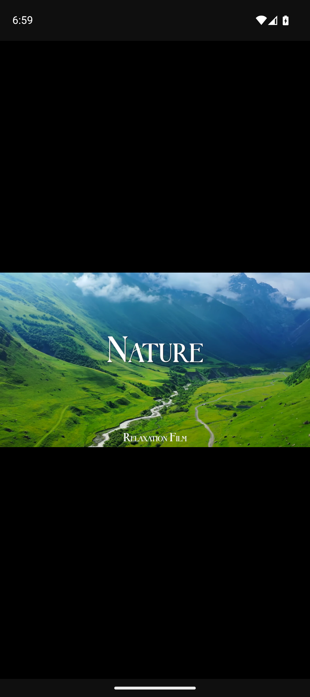
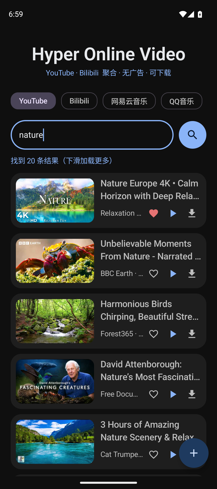

# 聚合视频 · Hyper Online Video

**YouTube · Bilibili · 网易云音乐 · QQ音乐 —— 一个 App，零广告，可下载。**

Android 原生播放器（Kotlin + Jetpack Compose + Material 3），基于 **libmpv** 播放、**yt-dlp** 下载，
支持在线看、离线存、后台听、队列连播、歌词、字幕、画中画。

<p align="center">
  
  
</p>

---

## 免责声明（请务必先读）

> **本项目仅供个人学习、研究与技术交流使用，请在使用前阅读并同意以下全部内容。**

1. **内容来源与版权**：本应用只是一个**播放与下载工具**，本身不存储、不上传、不分发任何音视频内容。
   所有内容均来自第三方平台（YouTube、Bilibili、网易云音乐、QQ音乐等）的公开接口，
   **版权归原作者与平台所有**。
2. **合法使用**：请仅将本应用用于**个人学习、备份自己有权访问的内容**等合法用途。
   **严禁**将其用于商业用途、二次分发、批量爬取、绕过平台付费/会员机制等任何侵权或违法场景。
3. **平台条款**：使用本应用下载或播放内容，可能违反相关平台的用户协议。
   **是否使用、如何使用，由你自行判断并承担全部后果**，与本项目作者无关。
4. **账号风险**：应用内登录使用官方网页完成，登录凭据（Cookie）**仅保存在你自己的设备本地**，
   不会上传到任何服务器。但因使用第三方客户端导致的账号异常、限流、封禁等风险，需你自行承担。
5. **无担保**：本软件按"现状"提供，不提供任何明示或暗示的担保。
   因使用本软件造成的任何直接或间接损失（包括但不限于数据丢失、设备损坏、法律纠纷），作者不承担责任。
6. **合规**：请遵守你所在国家/地区的法律法规。**若你不同意以上任何一条，请立即停止使用并卸载本应用。**

---

## 功能一览

### 视频（YouTube / Bilibili）
- 双平台聚合搜索，封面瀑布流、无限下滑加载
- 排序（相关度 / 最新 / 播放最多）与时长（短 / 中 / 长）过滤器
- **零广告播放**：只播 CDN 直链，不经过任何官方播放器页面
- 清晰度切换（YouTube HLS 变体直切 / B站 qn 重解析，切换后保持播放进度）
- 倍速播放、进度记忆（退出后自动续播）
- 后台播放（通知栏 / 锁屏 / 耳机媒体键）、画中画（小窗，按 Home 自动进入）
- 全屏沉浸（强制横屏 + 系统栏隐藏；全屏可"铺满屏幕"，消除左右黑边）
- 手势：左半屏上下滑调亮度、右半屏调音量、双击左右半屏快进/快退 5 秒

### 音乐（网易云音乐 / QQ音乐）
- 搜索、播放、下载（**MP3 / FLAC 保留专辑封面与标签**）
- **VIP 无损音质**（登录后按会员权益自动取流），播放器内可**实时切换音质**（无损 / 320k / 128k）
- 双语歌词（原文 + 译文），逐行高亮与自动滚动
- **流量强制直连**：音乐请求与流媒体始终走物理网络（不随系统 VPN 走代理），
  避免海外线路导致的版权区域拦截

### 通用
- **播放队列**：顺序 / 单曲循环 / 随机，音乐、视频、本地文件可混排；通知栏上/下一首
- **下载管理**：2 并发队列、排队状态、批量下载（长按多选）、失败重试、仅 WiFi 下载、2GB LRU 自动清理
- **本地库**：排序（最近/名称/大小/类型）、库内搜索、重命名（同名字幕联动）、音乐标签显示
- **字幕**：本地同名 `.srt` 自动加载；在线字幕（B站 CC / YouTube 人工与自动字幕）
- **收藏**：一键收藏，收藏列表整体入队播放
- 设置：进度记忆、自动连播、手势开关、音质上限、仅 WiFi 下载

---

## 截图

| 主界面 | 搜索结果 | 播放中 |
|---|---|---|
|  |  |  |

> 截图取自 Android 模拟器（Pixel 9 / Android 15）。

## 从零构建（完整流程）

### 1. 环境要求

| 组件 | 版本要求 | 说明 |
|---|---|---|
| JDK | **17 或更高**（开发时使用 26） | Gradle 需要；项目在 `gradle.properties` 中可钉 `org.gradle.java.home` |
| Android SDK | compileSdk **37** / build-tools 35+ | 需接受 SDK 许可 |
| Gradle | 9.x（用项目自带 wrapper 亦可） | 依赖 AGP 9.4 |
| 系统 | macOS / Linux（Windows 未验证） | 构建机需能访问 Maven Central |

> `minSdk 35`、`targetSdk 34`（**刻意低于 35**：35 的强制 edge-to-edge 会与输入法、
> 状态栏 inset 冲突，详见项目文档的"踩坑"记录）。

### 2. 配置 SDK 路径

在项目根目录创建 `local.properties`（**已在 .gitignore 中，不会入库**）：

```properties
sdk.dir=/Users/你的用户名/Library/Android/sdk     # Linux: /home/你/Android/Sdk
```

或者设置环境变量：

```bash
export ANDROID_HOME=$HOME/Library/Android/sdk
export JAVA_HOME=$(/usr/libexec/java_home -v 17)   # 或你的 JDK 路径
```

### 3. 编译调试版并安装

```bash
git clone https://github.com/HougeLangley/HyperOnlineVideo.git
cd HyperOnlineVideo

# 编译 Debug APK
./gradlew :app:assembleDebug
# 产物：app/build/outputs/apk/debug/app-debug.apk

# 有线安装（设备需开启 USB 调试）
adb install -r app/build/outputs/apk/debug/app-debug.apk

# 或无线安装（Android 11+：先在开发者选项开启「无线调试」）
adb connect <手机IP>:5555
adb install -r app/build/outputs/apk/debug/app-debug.apk
```

### 4. 运行单元测试

```bash
./gradlew :app:testDebugUnitTest
# 报告：app/build/reports/tests/testDebugUnitTest/index.html
```

### 5. 编译发布版（Release，需自签名）

项目**不包含**任何签名密钥。请自行生成 keystore：

```bash
mkdir -p ~/keystores
keytool -genkeypair -v \
  -keystore ~/keystores/hov-release.jks \
  -alias hov -keyalg RSA -keysize 4096 -validity 10950
```

然后创建 `~/keystores/keystore.properties`：

```properties
storeFile=/Users/你的用户名/keystores/hov-release.jks
storePassword=你的密码
keyAlias=hov
keyPassword=你的密码
```

```bash
./gradlew :app:assembleRelease
# 产物：app/build/outputs/apk/release/app-release.apk（含 R8 混淆与资源压缩）
```

> **没有 keystore 也能构建**：脚本检测不到 `keystore.properties` 时会跳过签名，
> 生成的是未签名包（无法安装，仅用于验证编译链路是否通畅）。

### 6. 版本号规范

- `versionCode`：每次对外发版 **+1**（Android 只比较大小，不要求连续）
- `versionName`：语义化版本 `主.次.修`，例如 `1.0.0`

### 常见构建问题

| 现象 | 原因与解决 |
|---|---|
| `Could not determine java version` | JDK 版本过低 → 升级到 17+，或修改 `gradle.properties` 里的 `org.gradle.java.home` |
| `SDK location not found` | 未配置 `local.properties` 或 `ANDROID_HOME` |
| `Failed to install ... INSTALL_FAILED_UPDATE_INCOMPATIBLE` | 设备上已有**不同签名**的同包名应用 → 先 `adb uninstall com.hougelangley.hov`（会清空应用数据） |
| Release 包启动闪退 | 若自行修改了依赖，注意为新引入的"静态初始化里反射扫类"的库补 R8 keep 规则 |

---

## 技术栈

| 层 | 选型 |
|---|---|
| 语言 / UI | Kotlin + Jetpack Compose + Material 3（深色主题） |
| 播放内核 | **libmpv**（mpv-android-lib）—— 硬解、多格式、精确 seek |
| 下载 | **yt-dlp**（内嵌 Python，随包分发 + 启动时自动检查更新） |
| 视频解析 | YouTube：播放器响应选流（HLS 视频 + DASH 音轨）；Bilibili：原生 API（buvid3 + SESSDATA） |
| 音乐解析 | 网易云（weapi 加密 + URL 签名）、QQ音乐（musicu.fcg + vkey） |
| 网络 | 音乐请求强制走物理直连网络；本地回环代理把 native 层流量也拉回直连 |
| 构建 | AGP 9.4 / Kotlin 2.2 / Compose BOM / Gradle 9 |

---

## 第三方组件与许可

本项目以 **GNU GPL-3.0** 发布。所有依赖均与 GPL-3.0 **兼容**：

| 组件 | 许可 | 与 GPL-3.0 兼容 |
|---|---|---|
| yt-dlp | The Unlicense（公共领域） | ✅ |
| Python | PSF License | ✅ |
| FFmpeg | LGPL-2.1+ / GPL（取决于构建选项） | ✅ |
| mpv / libmpv | LGPL-2.1+（GPL 部分按需启用） | ✅ |
| youtubedl-android | GPL-3.0 | ✅（同协议） |
| AndroidX / Jetpack Compose / Material 3 | Apache-2.0 | ✅ |
| Coil（图片加载） | Apache-2.0 | ✅ |
| Kotlin / kotlinx.coroutines | Apache-2.0 | ✅ |
| JUnit / org.json（仅测试） | EPL-1.0 / Public Domain | ✅ |

> 说明：GPL-3.0 要求**衍生作品同样以 GPL-3.0 开源**。
> 若你二次分发本项目的修改版，请一并提供完整源码。

---

## 隐私说明

- **登录**：使用各平台官方网页在应用内完成，登录凭据（Cookie）**仅保存在设备本地**
  （应用私有目录），不会上传到任何第三方服务器。
- **下载内容**：保存在设备本地（应用外部存储目录），应用不收集、不上传。
- **无统计、无追踪**：本应用不包含任何分析 SDK、广告 SDK 或遥测代码。
- **网络请求**：仅用于访问各平台官方接口与内容 CDN；音乐相关请求强制走物理直连网络。

---

## 喝杯咖啡 ☕

如果这个项目帮到了你，可以请我喝一杯咖啡 —— 完全自愿，不影响任何功能。

<p align="center">
  
</p>

---

## 致谢

- [yt-dlp](https://github.com/yt-dlp/yt-dlp) —— 强大的下载引擎
- [youtubedl-android](https://github.com/JunkFood02/youtubedl-android) —— Android 端 yt-dlp 集成
- [mpv](https://github.com/mpv-player/mpv) / [mpv-android](https://github.com/mpv-android/mpv-android) —— 播放内核
- 以及 Jetpack Compose、Coil、Kotlin 等所有开源项目的作者们

## 许可

[GNU General Public License v3.0](LICENSE)
